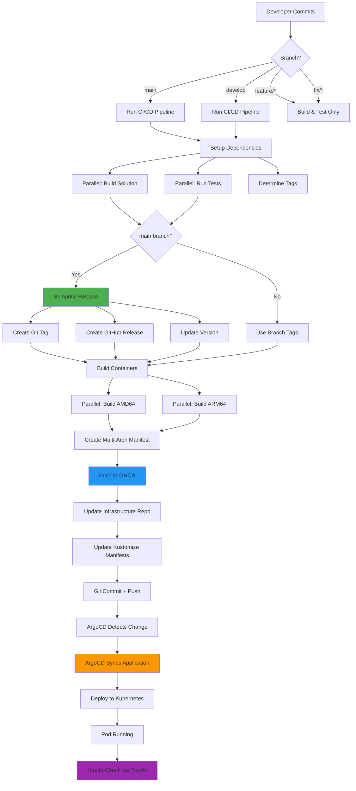
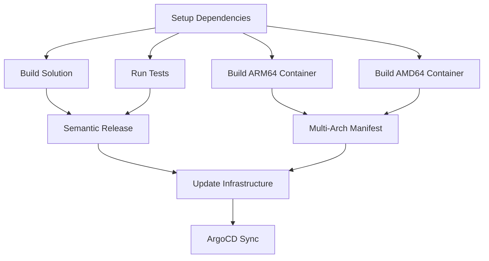
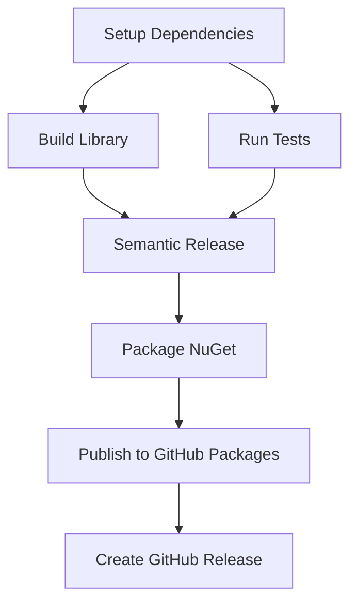

# MaestroAI GitHub Actions & Workflows

Central repository for modular GitHub Actions and reusable workflows for the MaestroAI ecosystem.

## 🏗️ Modular Architecture

This repository provides a complete **modular CI/CD system** built with:

- **🧩 Composite Actions**: Reusable building blocks
- **🔄 Reusable Workflows**: Complete pipelines for microservices and libraries
- **⚡ Local References**: Fast execution with `./actions/` imports
- **🎯 Zero Configuration**: Works out-of-the-box for most .NET projects

## 📋 Table of Contents

- [Development Workflow & Release Cycle](#-development-workflow--release-cycle)
- [Complete CI/CD Pipeline Flow](#-complete-cicd-pipeline-flow)
- [Composite Actions](#-composite-actions)
- [Reusable Workflows](#-reusable-workflows)
- [Architecture](#-architecture)
- [Supported Projects](#-supported-projects)
- [Prerequisites](#-prerequisites)
- [Getting Started](#-getting-started)

## 🔄 Development Workflow & Release Cycle

### Overview

The MaestroAI platform uses a **GitOps-based continuous deployment** workflow with automated versioning, multi-architecture container builds, and ArgoCD-managed deployments.

### Branch Strategy

| Branch | Purpose | Triggers | Deployment Target |
|--------|---------|----------|-------------------|
| `main` | Production releases | Semantic versioning + release creation | Production (latest tag) |
| `develop` | Integration/staging | Build + deploy with develop-latest tag | Staging environment |
| `feature/*` | New features | Build only (no deploy) | N/A |
| `fix/*` | Bug fixes | Build only (no deploy) | N/A |
| `hotfix/*` | Production hotfixes | Fast AMD64-only build | Production (expedited) |

### Complete Release Cycle



### Detailed Pipeline Stages

#### Stage 1: Code Commit & Trigger
```bash
# Developer commits with conventional commit message
git commit -m "feat(react): add new user dashboard"
git push origin main
```

**Conventional Commit Types:**
- `feat:` New feature (triggers MINOR version bump)
- `fix:` Bug fix (triggers PATCH version bump)
- `BREAKING CHANGE:` Breaking change (triggers MAJOR version bump)
- `chore:` Maintenance (no version bump)
- `docs:` Documentation only (no version bump)

#### Stage 2: CI/CD Pipeline Execution

1. **Setup Dependencies** (30s)
   - Checkout code with full history
   - Setup .NET 8.0 SDK
   - Configure NuGet sources (GitHub Packages)
   - Restore dependencies with cache
   - Determine preliminary tags

2. **Build Solution** (Parallel, ~45s)
   - Build in Release configuration
   - Generate build artifacts
   - Cache build outputs

3. **Run Tests** (Parallel, ~60s)
   - Execute unit tests
   - Generate code coverage reports
   - Upload test results

4. **Semantic Versioning & Release** (main branch only, ~30s)
   - Analyze commit messages since last release
   - Calculate next semantic version (e.g., `1.2.3`)
   - Create Git tag
   - Generate GitHub Release with changelog
   - Update version in manifests

5. **Architecture Detection** (~10s)
   - Analyze commit message for architecture tags
   - Check branch patterns (hotfix = AMD64 only)
   - Detect documentation-only changes (skip builds)
   - Check PR labels for build instructions
   - Default: build both AMD64 and ARM64

6. **Build Containers** (Parallel, ~3-4 minutes)

   **AMD64 Build:**
   ```bash
   docker buildx build \
     --platform linux/amd64 \
     --tag ghcr.io/marcelpiva-org/maestro-react-app:1.2.3-amd64 \
     --push
   ```

   **ARM64 Build:**
   ```bash
   docker buildx build \
     --platform linux/arm64 \
     --tag ghcr.io/marcelpiva-org/maestro-react-app:1.2.3-arm64 \
     --push
   ```

7. **Create Multi-Arch Manifest** (~20s)
   ```bash
   docker buildx imagetools create \
     --tag ghcr.io/marcelpiva-org/maestro-react-app:1.2.3 \
     ghcr.io/marcelpiva-org/maestro-react-app:1.2.3-amd64 \
     ghcr.io/marcelpiva-org/maestro-react-app:1.2.3-arm64

   docker buildx imagetools create \
     --tag ghcr.io/marcelpiva-org/maestro-react-app:latest \
     ghcr.io/marcelpiva-org/maestro-react-app:1.2.3-amd64 \
     ghcr.io/marcelpiva-org/maestro-react-app:1.2.3-arm64
   ```

8. **Update Infrastructure Repository** (~30s)
   ```bash
   # Clone infrastructure repository
   git clone https://github.com/marcelpiva-org/maestroai-infrastructure

   # Update deployment manifest
   sed -i "s|image: ghcr.io/marcelpiva-org/maestro-react-app:.*|image: ghcr.io/marcelpiva-org/maestro-react-app:1.2.3|" \
     kubernetes/argocd/base/react-deployment.yaml

   # Commit and push
   git commit -m "chore(react): update image tag to v1.2.3"
   git push
   ```

#### Stage 3: GitOps Deployment

9. **ArgoCD Sync** (Auto, within 3 minutes)
   - ArgoCD polls infrastructure repository
   - Detects change in `react-deployment.yaml`
   - Compares desired state vs current state
   - Triggers synchronization

10. **Kubernetes Deployment** (~30-60s)
    ```bash
    # ArgoCD applies new manifest
    kubectl apply -f kubernetes/argocd/base/react-deployment.yaml

    # Kubernetes creates new ReplicaSet
    # Rolling update: new pod starts, old pod terminates
    ```

11. **Pod Startup & Health Checks**
    ```yaml
    # Pod lifecycle
    - ImagePull: Pull ghcr.io/marcelpiva-org/maestro-react-app:1.2.3
    - ContainerCreating: Initialize container
    - Running: Start application
    - ReadinessProbe: HTTP GET /health (every 10s)
    - LivenessProbe: HTTP GET /health (every 30s)
    ```

12. **Service Mesh & Ingress** (Immediate)
    ```
    External Request
    ↓
    Traefik Ingress (traefik.local)
    ↓
    Gateway Service (maestroai-gateway:80)
    ↓
    React Service (maestroai-react:80)
    ↓
    React Pod (container:8080)
    ↓
    Response from /health endpoint
    ```

### Image Tagging Strategy

| Branch | Tags Created | Example |
|--------|--------------|---------|
| `main` (semantic) | `{version}`, `latest` | `1.2.3`, `latest` |
| `main` (no semantic) | `main-{sha}` | `main-abc1234` |
| `develop` | `develop-{sha}`, `develop-latest` | `develop-def5678`, `develop-latest` |
| `feature/xyz` | `feature-xyz-{sha}` | `feature-xyz-ghi9012` |

### Registry Organization

**GitHub Container Registry (GHCR)**
```
ghcr.io/marcelpiva-org/
├── maestro-react-app:latest
├── maestro-react-app:1.2.3
├── maestro-react-app:1.2.3-amd64
├── maestro-react-app:1.2.3-arm64
├── maestro-gateway-app:latest
├── maestro-knowledge-app:latest
└── ...
```

**Naming Convention:**
- Microservices: `maestro-{service}-app` (suffix `-app` to avoid NuGet conflicts)
- Libraries: `maestroai-{library}` (NuGet packages in GitHub Packages)

### ArgoCD Application Structure

```
maestroai-infrastructure/
├── kubernetes/argocd/
│   ├── applications/
│   │   └── maestroai-local.yaml          # ArgoCD Application definition
│   ├── base/                             # Base Kubernetes manifests
│   │   ├── namespace.yaml
│   │   ├── react-deployment.yaml         # Deployment + Service
│   │   ├── gateway-deployment.yaml
│   │   ├── knowledge-deployment.yaml
│   │   └── kustomization.yaml
│   └── environments/
│       └── local/
│           └── kustomization.yaml        # Environment-specific overlays
```

### Version Artifact Locations

| Artifact | Location | Example |
|----------|----------|---------|
| Git Tag | GitHub Repository Tags | `v1.2.3` |
| GitHub Release | GitHub Releases | `v1.2.3` with changelog |
| Container Image | GHCR | `ghcr.io/marcelpiva-org/maestro-react-app:1.2.3` |
| Deployment Manifest | Infrastructure Repo | `kubernetes/argocd/base/react-deployment.yaml` |
| Running Pod | Kubernetes Cluster | `maestroai-react-7d4f8b9c-xk2lm` |

### Health Check Verification

```bash
# Internal health check (from within cluster)
kubectl exec -it maestroai-react-xxx -- curl http://localhost:8080/health

# Service health check
kubectl run -it --rm debug --image=curlimages/curl -- curl http://maestroai-react/health

# Ingress health check (external)
curl http://traefik.local/api/react/health
```

### Monitoring Deployment Status

```bash
# Watch ArgoCD application status
kubectl get application maestroai-local -n argocd -w

# Watch pod rollout
kubectl rollout status deployment/maestroai-react -n maestroai

# Check pod logs
kubectl logs -f deployment/maestroai-react -n maestroai

# Verify image version
kubectl get pod -n maestroai -o jsonpath='{.items[0].spec.containers[0].image}'
```

### Rollback Procedures

**Automatic Rollback (Failed Health Checks):**
```bash
# Kubernetes automatically rolls back if new pods fail readiness/liveness probes
kubectl rollout undo deployment/maestroai-react -n maestroai
```

**Manual Rollback (ArgoCD):**
```bash
# Revert to previous version in infrastructure repo
cd maestroai-infrastructure
git revert HEAD
git push

# Or use ArgoCD rollback
argocd app rollback maestroai-local --server argocd-server -n argocd
```

**Manual Rollback (Kubernetes):**
```bash
# Rollback to previous revision
kubectl rollout undo deployment/maestroai-react -n maestroai

# Rollback to specific revision
kubectl rollout undo deployment/maestroai-react --to-revision=2 -n maestroai
```

### Typical Timeline

| Stage | Duration | Cumulative |
|-------|----------|------------|
| Code Push → Pipeline Start | ~5s | 5s |
| Setup Dependencies | ~30s | 35s |
| Build + Test (parallel) | ~60s | 95s |
| Semantic Release | ~30s | 125s |
| Container Builds (parallel) | ~4min | ~5min |
| Multi-Arch Manifest | ~20s | ~5.5min |
| Update Infrastructure | ~30s | ~6min |
| ArgoCD Detection | ~3min | ~9min |
| Kubernetes Deployment | ~60s | ~10min |
| Pod Ready + Health Checks | ~30s | ~10.5min |
| **Total: Commit → Production** | | **~10-11 minutes** |

### Performance Optimizations in Use

- ✅ Parallel job execution (build, test, multi-arch containers)
- ✅ NuGet package caching (95%+ hit rate)
- ✅ Docker layer caching (BuildKit)
- ✅ Self-hosted ARM64 runners (native builds)
- ✅ GitHub Actions Runner Controller (ARC) autoscaling
- ✅ Kubernetes readiness gates for zero-downtime deployments
- ✅ ArgoCD automated sync (3-minute polling interval)

## 📦 Composite Actions

### Core Actions

| Action | Description | Usage |
|--------|-------------|-------|
| `setup-dotnet` | .NET SDK setup + caching + GitHub Packages | Required for all jobs |
| `build-dotnet` | Build solution with Release configuration | Build step |
| `test-dotnet` | Run tests with code coverage | Test execution |
| `semantic-release` | Automated versioning with conventional commits | Release management |

### Container Actions

| Action | Description | Usage |
|--------|-------------|-------|
| `docker-build` | Multi-arch containers (ARM64/AMD64) + caching | Container builds |
| `update-infrastructure` | GitOps Kustomize updates | Infrastructure sync |

### Library Actions

| Action | Description | Usage |
|--------|-------------|-------|
| `nuget-package` | NuGet packaging + GitHub Packages publishing | Library releases |

## 🔄 Reusable Workflows

### 🚀 Microservices: `dotnet-microservice.yml`

Complete CI/CD pipeline for .NET microservices with containers, GitOps, and multi-arch builds.

```yaml
name: CI/CD Pipeline

on:
  push:
    branches: [main, develop]
  pull_request:
    branches: [main, develop]

jobs:
  build-deploy:
    uses: marcelpiva-org/maestroai-github-actions/.github/workflows/dotnet-microservice.yml@main
    with:
      service_name: knowledge  # Required: your service name
    secrets: inherit
```

#### Parameters

| Parameter | Required | Default | Description |
|-----------|----------|---------|-------------|
| `service_name` | ✅ Yes | - | Microservice name (e.g., knowledge, chat, agents) |
| `dotnet_version` | ❌ No | `8.0` | .NET version to use |
| `solution_path` | ❌ No | `src` | Path to solution/project files |
| `has_tests` | ❌ No | `true` | Whether the service has tests |
| `enable_semantic_release` | ❌ No | `true` | Enable semantic versioning |
| `update_infrastructure` | ❌ No | `true` | Update infrastructure repository |
| `registry` | ❌ No | `ghcr.io` | Container registry |

### 📚 Libraries: `dotnet-library.yml`

Specialized pipeline for .NET libraries with NuGet packaging and GitHub Packages publishing.

```yaml
name: Library CI/CD

on:
  push:
    branches: [main, develop]
  pull_request:
    branches: [main, develop]

jobs:
  build-publish:
    uses: marcelpiva-org/maestroai-github-actions/.github/workflows/dotnet-library.yml@main
    with:
      library_name: common  # Required: your library name
    secrets: inherit
```

#### Parameters

| Parameter | Required | Default | Description |
|-----------|----------|---------|-------------|
| `library_name` | ✅ Yes | - | Library name (e.g., common, shared, contracts) |
| `dotnet_version` | ❌ No | `8.0` | .NET version to use |
| `project_path` | ❌ No | `src` | Path to the project file |
| `has_tests` | ❌ No | `true` | Whether the library has tests |
| `enable_semantic_release` | ❌ No | `true` | Enable semantic versioning |
| `publish_nuget` | ❌ No | `true` | Publish NuGet package |

## 🏗️ Architecture

### Microservice Pipeline Flow



### Library Pipeline Flow



## 📊 Performance Optimizations

- **⚡ Parallel Execution**: Build, test, and container creation run simultaneously
- **💾 Advanced Caching**: NuGet packages, .NET tools, build artifacts, Docker layers
- **🏗️ Matrix Builds**: ARM64 and AMD64 containers build in parallel
- **🎯 Local Actions**: No external downloads, faster execution
- **🧠 Intelligent Dependencies**: Optimized job dependency chains

## 🎯 Supported Projects

### Microservices ✅

- maestroai-knowledge-app
- maestroai-chat-app
- maestroai-agents-app
- maestroai-gateway-app
- maestroai-identity-app
- maestroai-orchestration-app
- maestroai-providers-app
- maestroai-cache-app

### Libraries ✅

- maestroai-common
- maestroai-shared
- maestroai-contracts
- Any .NET library project

### Frontend 🔄

- maestroai-react-app (requires different workflow)

## 🔧 Prerequisites

- **Runners**: Actions Runner Controller (ARC) with autoscaling (min: 3, max: 8)
  - Namespace: `arc-system`
  - Labels: `[self-hosted, linux, arm64, maestroai]`
  - Controller: `actions-runner-controller`
- **Docker**: BuildKit support for multi-arch builds
- **Registry**: Access to GitHub Container Registry (GHCR)
- **Infrastructure**: `marcelpiva-org/maestroai-infrastructure` repository
- **Secrets**: `PACKAGES_TOKEN` for private NuGet packages

## 🔒 Required Secrets

| Secret | Description | Required For |
|--------|-------------|--------------|
| `GITHUB_TOKEN` | GitHub API access (auto-provided) | All workflows |
| `PACKAGES_TOKEN` | Private NuGet packages + infrastructure updates | Private packages, GitOps |

## 📦 Generated Artifacts

### Container Images
- **Registry**: `ghcr.io/marcelpiva-org/maestro-{service_name}-app`
- **Tags**: `latest`, semantic versions, branch tags
- **Architectures**: `linux/amd64`, `linux/arm64`
- **Naming Convention**: Microservices use `-app` suffix to avoid conflicts with library packages

### NuGet Packages
- **Registry**: GitHub Packages (`https://nuget.pkg.github.com/marcelpiva-org/index.json`)
- **Versioning**: Semantic versioning with conventional commits
- **Visibility**: Organization-scoped packages

## 🚀 Getting Started

### For Microservices

1. Create `.github/workflows/ci-cd.yml` with microservice workflow
2. Configure `service_name` parameter
3. Ensure `PACKAGES_TOKEN` secret is set
4. Push to `main` or `develop` to trigger pipeline

### For Libraries

1. Create `.github/workflows/ci-cd.yml` with library workflow
2. Configure `library_name` parameter
3. Ensure `PACKAGES_TOKEN` secret is set
4. Push to `main` to trigger packaging and publishing

## 🔄 Workflow Updates

This modular system is continuously improved:

- **Latest**: Use `@main` for cutting-edge features
- **Stable**: Use specific version tags like `@v1.0.0`
- **Actions**: Always use latest via local `./actions/` references

## 🛠️ Development

### Adding New Actions

1. Create new directory under `actions/`
2. Add `action.yml` with composite action definition
3. Update workflows to use the new action
4. Test with a microservice or library
5. Document in this README

### Modifying Workflows

1. Update workflow files in `.github/workflows/`
2. Test with representative repositories
3. Update documentation and examples
4. Version tag for stable releases

## 📈 Monitoring

Track pipeline performance and success rates:

- **Pipeline Duration**: ~5-6 minutes (vs 15-20 minutes traditional)
- **Success Rate**: Monitor via GitHub Actions insights
- **Resource Usage**: ARM64 runners provide excellent performance
- **Cache Hit Rates**: Monitor NuGet and Docker cache effectiveness

## 📞 Support

- **Issues**: Create issues in this repository
- **Discussions**: Use GitHub Discussions for questions
- **DevOps Team**: Contact for infrastructure-related requests
- **Documentation**: Keep this README updated with changes

---

🤖 **Generated with [Claude Code](https://claude.ai/code)**