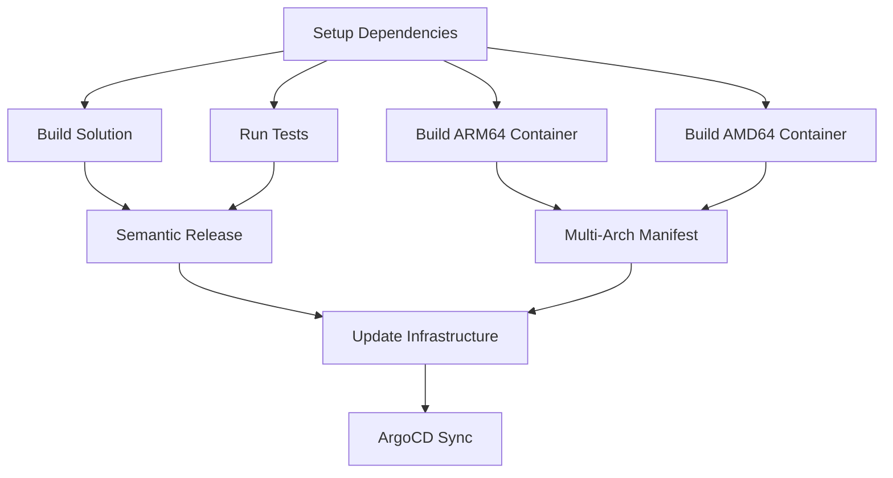
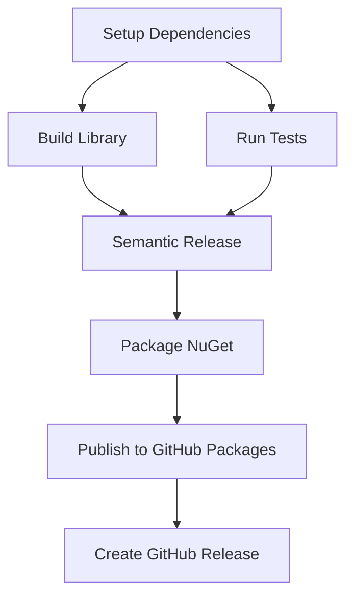

# MaestroAI GitHub Actions & Workflows

Central repository for modular GitHub Actions and reusable workflows for the MaestroAI ecosystem.

## 🏗️ Modular Architecture

This repository provides a complete **modular CI/CD system** built with:

- **🧩 Composite Actions**: Reusable building blocks
- **🔄 Reusable Workflows**: Complete pipelines for microservices and libraries
- **⚡ Local References**: Fast execution with `./actions/` imports
- **🎯 Zero Configuration**: Works out-of-the-box for most .NET projects

## 📦 Composite Actions

### Core Actions

| Action | Description | Usage |
|--------|-------------|-------|
| `setup-dotnet` | .NET SDK setup + caching + GitHub Packages | Required for all jobs |
| `build-dotnet` | Build solution with Release configuration | Build step |
| `test-dotnet` | Run tests with code coverage | Test execution |
| `semantic-release` | Automated versioning with conventional commits | Release management |

### Container Actions

| Action | Description | Usage |
|--------|-------------|-------|
| `docker-build` | Multi-arch containers (ARM64/AMD64) + caching | Container builds |
| `update-infrastructure` | GitOps Kustomize updates | Infrastructure sync |

### Library Actions

| Action | Description | Usage |
|--------|-------------|-------|
| `nuget-package` | NuGet packaging + GitHub Packages publishing | Library releases |

## 🔄 Reusable Workflows

### 🚀 Microservices: `dotnet-microservice.yml`

Complete CI/CD pipeline for .NET microservices with containers, GitOps, and multi-arch builds.

```yaml
name: CI/CD Pipeline

on:
  push:
    branches: [main, develop]
  pull_request:
    branches: [main, develop]

jobs:
  build-deploy:
    uses: marcelpiva-org/maestroai-github-actions/.github/workflows/dotnet-microservice.yml@main
    with:
      service_name: knowledge  # Required: your service name
    secrets: inherit
```

#### Parameters

| Parameter | Required | Default | Description |
|-----------|----------|---------|-------------|
| `service_name` | ✅ Yes | - | Microservice name (e.g., knowledge, chat, agents) |
| `dotnet_version` | ❌ No | `8.0` | .NET version to use |
| `solution_path` | ❌ No | `src` | Path to solution/project files |
| `has_tests` | ❌ No | `true` | Whether the service has tests |
| `enable_semantic_release` | ❌ No | `true` | Enable semantic versioning |
| `update_infrastructure` | ❌ No | `true` | Update infrastructure repository |
| `registry` | ❌ No | `ghcr.io` | Container registry |

### 📚 Libraries: `dotnet-library.yml`

Specialized pipeline for .NET libraries with NuGet packaging and GitHub Packages publishing.

```yaml
name: Library CI/CD

on:
  push:
    branches: [main, develop]
  pull_request:
    branches: [main, develop]

jobs:
  build-publish:
    uses: marcelpiva-org/maestroai-github-actions/.github/workflows/dotnet-library.yml@main
    with:
      library_name: common  # Required: your library name
    secrets: inherit
```

#### Parameters

| Parameter | Required | Default | Description |
|-----------|----------|---------|-------------|
| `library_name` | ✅ Yes | - | Library name (e.g., common, shared, contracts) |
| `dotnet_version` | ❌ No | `8.0` | .NET version to use |
| `project_path` | ❌ No | `src` | Path to the project file |
| `has_tests` | ❌ No | `true` | Whether the library has tests |
| `enable_semantic_release` | ❌ No | `true` | Enable semantic versioning |
| `publish_nuget` | ❌ No | `true` | Publish NuGet package |

## 🏗️ Architecture

### Microservice Pipeline Flow



### Library Pipeline Flow



## 📊 Performance Optimizations

- **⚡ Parallel Execution**: Build, test, and container creation run simultaneously
- **💾 Advanced Caching**: NuGet packages, .NET tools, build artifacts, Docker layers
- **🏗️ Matrix Builds**: ARM64 and AMD64 containers build in parallel
- **🎯 Local Actions**: No external downloads, faster execution
- **🧠 Intelligent Dependencies**: Optimized job dependency chains

## 🎯 Supported Projects

### Microservices ✅

- maestroai-knowledge-app
- maestroai-chat-app
- maestroai-agents-app
- maestroai-gateway-app
- maestroai-identity-app
- maestroai-orchestration-app
- maestroai-providers-app
- maestroai-cache-app

### Libraries ✅

- maestroai-common
- maestroai-shared
- maestroai-contracts
- Any .NET library project

### Frontend 🔄

- maestroai-react-app (requires different workflow)

## 🔧 Prerequisites

- **Runners**: Actions Runner Controller (ARC) with autoscaling (min: 3, max: 8)
  - Namespace: `arc-system`
  - Labels: `[self-hosted, linux, arm64, maestroai]`
  - Controller: `actions-runner-controller`
- **Docker**: BuildKit support for multi-arch builds
- **Registry**: Access to GitHub Container Registry (GHCR)
- **Infrastructure**: `marcelpiva-org/maestroai-infrastructure` repository
- **Secrets**: `PACKAGES_TOKEN` for private NuGet packages

## 🔒 Required Secrets

| Secret | Description | Required For |
|--------|-------------|--------------|
| `GITHUB_TOKEN` | GitHub API access (auto-provided) | All workflows |
| `PACKAGES_TOKEN` | Private NuGet packages + infrastructure updates | Private packages, GitOps |

## 📦 Generated Artifacts

### Container Images
- **Registry**: `ghcr.io/marcelpiva-org/maestro-{service_name}-app`
- **Tags**: `latest`, semantic versions, branch tags
- **Architectures**: `linux/amd64`, `linux/arm64`
- **Naming Convention**: Microservices use `-app` suffix to avoid conflicts with library packages

### NuGet Packages
- **Registry**: GitHub Packages (`https://nuget.pkg.github.com/marcelpiva-org/index.json`)
- **Versioning**: Semantic versioning with conventional commits
- **Visibility**: Organization-scoped packages

## 🚀 Getting Started

### For Microservices

1. Create `.github/workflows/ci-cd.yml` with microservice workflow
2. Configure `service_name` parameter
3. Ensure `PACKAGES_TOKEN` secret is set
4. Push to `main` or `develop` to trigger pipeline

### For Libraries

1. Create `.github/workflows/ci-cd.yml` with library workflow
2. Configure `library_name` parameter
3. Ensure `PACKAGES_TOKEN` secret is set
4. Push to `main` to trigger packaging and publishing

## 🔄 Workflow Updates

This modular system is continuously improved:

- **Latest**: Use `@main` for cutting-edge features
- **Stable**: Use specific version tags like `@v1.0.0`
- **Actions**: Always use latest via local `./actions/` references

## 🛠️ Development

### Adding New Actions

1. Create new directory under `actions/`
2. Add `action.yml` with composite action definition
3. Update workflows to use the new action
4. Test with a microservice or library
5. Document in this README

### Modifying Workflows

1. Update workflow files in `.github/workflows/`
2. Test with representative repositories
3. Update documentation and examples
4. Version tag for stable releases

## 📈 Monitoring

Track pipeline performance and success rates:

- **Pipeline Duration**: ~5-6 minutes (vs 15-20 minutes traditional)
- **Success Rate**: Monitor via GitHub Actions insights
- **Resource Usage**: ARM64 runners provide excellent performance
- **Cache Hit Rates**: Monitor NuGet and Docker cache effectiveness

## 📞 Support

- **Issues**: Create issues in this repository
- **Discussions**: Use GitHub Discussions for questions
- **DevOps Team**: Contact for infrastructure-related requests
- **Documentation**: Keep this README updated with changes

---

🤖 **Generated with [Claude Code](https://claude.ai/code)**