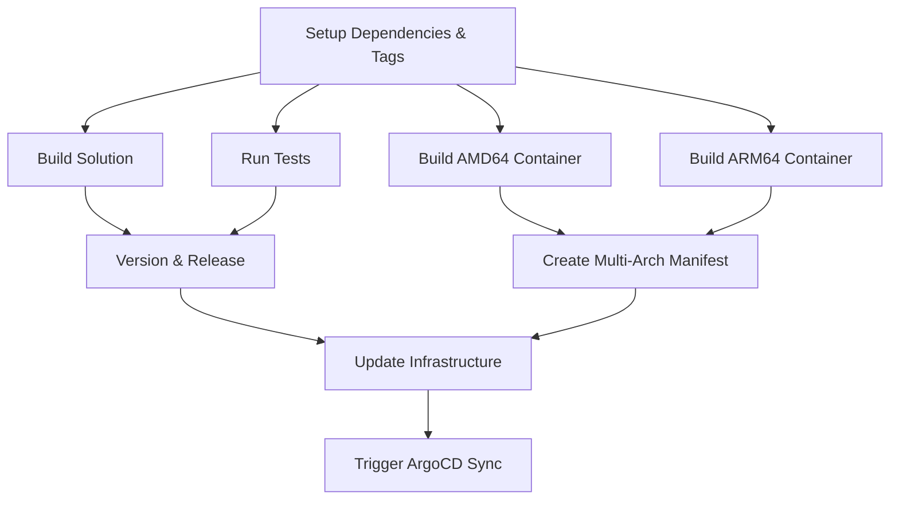

# MaestroAI GitHub Workflows

Central repository for reusable GitHub workflows and organization-wide configurations for MaestroAI microservices.

## 🚀 Ultra-Optimized .NET Microservice CI/CD

This repository provides a comprehensive, ultra-optimized CI/CD workflow for .NET microservices with:

- **⚡ Maximum Parallelization**: Matrix builds, parallel test/build execution
- **💾 Advanced Caching**: Complete dependency and build artifact caching
- **🐳 Multi-Architecture Containers**: ARM64 and AMD64 support
- **🔄 GitOps Integration**: Automatic infrastructure updates
- **📦 Semantic Versioning**: Automated releases with conventional commits
- **🎯 Zero Configuration**: Works out-of-the-box for most .NET projects

## 📊 Performance

**Before**: Traditional CI/CD (~15-20 minutes)
**After**: Ultra-optimized workflow (~5-6 minutes)

**Improvements**:
- 🚀 ~70% faster execution time
- 💪 4x more parallel execution
- 🎯 Intelligent caching strategies
- ⚡ Matrix-based container builds

## 🔧 Usage

### Basic Usage

Create `.github/workflows/ci-cd.yml` in your microservice repository:

```yaml
name: CI/CD Pipeline

on:
  push:
    branches: [main, develop]
  pull_request:
    branches: [main, develop]

jobs:
  build-deploy:
    uses: marcelpiva-org/.github/.github/workflows/dotnet-microservice.yml@main
    with:
      service_name: knowledge  # Required: your service name
    secrets: inherit
```

### Advanced Configuration

```yaml
name: CI/CD Pipeline

on:
  push:
    branches: [main, develop]
  pull_request:
    branches: [main, develop]

jobs:
  build-deploy:
    uses: marcelpiva-org/.github/.github/workflows/dotnet-microservice.yml@main
    with:
      service_name: knowledge
      dotnet_version: '8.0'
      solution_path: 'src'
      has_tests: true
      enable_semantic_release: true
      update_infrastructure: true
      registry: 'ghcr.io'
    secrets: inherit
```

## 📋 Parameters

| Parameter | Required | Default | Description |
|-----------|----------|---------|-------------|
| `service_name` | ✅ Yes | - | Microservice name (e.g., knowledge, chat, agents) |
| `dotnet_version` | ❌ No | `8.0` | .NET version to use |
| `solution_path` | ❌ No | `src` | Path to solution/project files |
| `has_tests` | ❌ No | `true` | Whether the service has tests |
| `enable_semantic_release` | ❌ No | `true` | Enable semantic versioning |
| `update_infrastructure` | ❌ No | `true` | Update infrastructure repository |
| `registry` | ❌ No | `ghcr.io` | Container registry |

## 🔒 Required Secrets

The workflow requires these secrets to be available:

- `GITHUB_TOKEN` (automatically provided)
- `PACKAGES_TOKEN` (optional: for private NuGet packages)

## 🏗️ Architecture

### Jobs Execution Flow



### Key Optimizations

1. **Matrix Container Builds**: AMD64 and ARM64 build simultaneously
2. **Enhanced Caching**: Comprehensive cache for NuGet, .NET tools, and build artifacts
3. **Job Consolidation**: Multiple operations per job to reduce overhead
4. **Intelligent Dependencies**: Optimized job dependency chain
5. **Parallel Execution**: Build, test, and version operations run concurrently

## 🎯 Supported Microservices

This workflow is designed for MaestroAI microservices:

- ✅ maestroai-knowledge-app
- ✅ maestroai-chat-app
- ✅ maestroai-agents-app
- ✅ maestroai-gateway-app
- ✅ maestroai-identity-app
- ✅ maestroai-orchestration-app
- ✅ maestroai-providers-app
- ✅ maestroai-cache-app
- 🔄 maestroai-react-app (requires different workflow)

## 🔧 Prerequisites

- Self-hosted GitHub runners with labels: `[self-hosted, linux, arm64, maestroai]`
- Docker with BuildKit support
- Access to GitHub Container Registry (GHCR)
- Infrastructure repository: `marcelpiva-org/maestroai-infrastructure`

## 📦 Container Images

Generated container images are pushed to:
- Registry: `ghcr.io/marcelpiva-org/maestro-{service_name}`
- Tags: `latest`, version tags, branch tags
- Architectures: `linux/amd64`, `linux/arm64`

## 🚀 Getting Started

1. **Use the workflow** in your microservice repository
2. **Configure parameters** for your specific service
3. **Ensure secrets** are properly set
4. **Push to main/develop** to trigger the pipeline

## 🔄 Updates

This workflow is continuously improved. To get the latest optimizations:
- Use `@main` to always get the latest version
- Use specific version tags for stability: `@v1.0.0`

## 📞 Support

For issues or improvements, create an issue in this repository or contact the DevOps team.

---

🤖 **Generated with [Claude Code](https://claude.ai/code)**