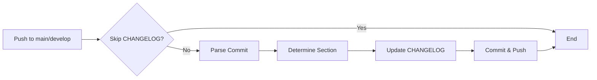

# 📋 CHANGELOG Automation Guide

Automated CHANGELOG.md update system using GitHub Actions for the MaestroAI platform.

## 🎯 Overview

This system automatically updates `CHANGELOG.md` files after every commit to `main` or `develop` branches, parsing conventional commit messages and organizing entries into appropriate sections.

### Benefits

✅ **Automatic**: No manual CHANGELOG updates needed
✅ **Consistent**: Follows [Keep a Changelog](https://keepachangelog.com/en/1.0.0/) format
✅ **CI/CD Based**: Runs in GitHub Actions, not local hooks
✅ **Smart**: Prevents infinite loops and duplicate entries
✅ **Conventional Commits**: Parses standard commit formats

---

## 🏗️ Architecture

### Components

1. **Reusable Workflow** (`.github/workflows/changelog-update.yml`)
   - Core logic for CHANGELOG generation
   - Centralized in `maestroai-github-actions` repository
   - Reused by all microservices and libraries

2. **Template Workflow** (`templates/workflows/changelog-automation.yml`)
   - Ready-to-use caller workflow
   - Copy to `.github/workflows/changelog.yml` in each repository

3. **CHANGELOG.md**
   - Auto-created if doesn't exist
   - Follows Keep a Changelog format
   - Entries added to `## [Unreleased]` section

### Workflow



---

## 🚀 Setup Instructions

### 1. Add to Existing Repository

Copy the template workflow to your repository:

```bash
# Navigate to your repository
cd /path/to/your/repo

# Create workflows directory if it doesn't exist
mkdir -p .github/workflows

# Copy the template
cp /path/to/maestroai-github-actions/templates/workflows/changelog-automation.yml \
   .github/workflows/changelog.yml

# Commit and push
git add .github/workflows/changelog.yml
git commit -m "feat(ci): add automatic CHANGELOG updates"
git push
```

### 2. Deploy to All Repositories

Use the deployment script:

```bash
# Deploy to all 17 repositories
/path/to/maestroai-github-actions/scripts/deploy-changelog-automation.sh
```

---

## 📝 Commit Message Format

The system parses **Conventional Commits** to determine the CHANGELOG section:

### Supported Types

| Commit Type | CHANGELOG Section | Example |
|-------------|-------------------|---------|
| `feat:` | `### Added` | `feat: add user authentication` |
| `fix:` | `### Fixed` | `fix: resolve memory leak` |
| `docs:` | `### Documentation` | `docs: update API guide` |
| `style:` | `### Changed` | `style: reformat code` |
| `refactor:` | `### Changed` | `refactor: simplify logic` |
| `perf:` | `### Performance` | `perf: optimize database query` |
| `test:` | `### Testing` | `test: add unit tests` |
| `build:`, `ci:`, `chore:` | `### Infrastructure` | `chore: update dependencies` |

### Commit Format

```
<type>(<scope>): <description>

[optional body]

[optional footer]
```

**Examples**:

```bash
# Feature
git commit -m "feat(auth): add JWT token validation"

# Bug fix
git commit -m "fix(database): resolve connection timeout"

# Documentation
git commit -m "docs(readme): add installation instructions"

# Infrastructure
git commit -m "chore(deps): update .NET to 8.0.1"
```

---

## 🛡️ Safeguards

### 1. Prevent Infinite Loops

The workflow includes multiple safeguards:

```yaml
on:
  push:
    paths-ignore:
      - 'CHANGELOG.md'  # Don't trigger on CHANGELOG changes
```

```yaml
if: "!contains(github.event.head_commit.message, '[skip changelog]')"
```

### 2. Duplicate Detection

The script checks if a commit is already in CHANGELOG:

```bash
if grep -q "($COMMIT_HASH)" "$CHANGELOG_FILE"; then
  echo "Commit already in CHANGELOG, skipping"
  exit 0
fi
```

### 3. Skip CHANGELOG Update

To skip CHANGELOG update for a specific commit:

```bash
git commit -m "your message [skip changelog]"
```

---

## 📊 CHANGELOG Format

### Auto-Generated Structure

```markdown
# Changelog

All notable changes to this project will be documented in this file.

The format is based on [Keep a Changelog](https://keepachangelog.com/en/1.0.0/),
and this project adheres to [Semantic Versioning](https://semver.org/spec/v2.0.0.html).

## [Unreleased]

### Added
- New feature (abc123) - John Doe

### Fixed
- Bug fix (def456) - Jane Smith

### Documentation
- Updated README (ghi789) - Bob Johnson

## [1.0.0] - 2024-01-15

### Added
- Initial release
```

### Entry Format

```
- <description> (<commit-hash>) - <author>
```

**Example**:
```
- Add user authentication (a1b2c3d) - John Doe
```

---

## 🔧 Configuration

### Custom CHANGELOG Path

If your CHANGELOG is in a different location:

```yaml
jobs:
  update-changelog:
    uses: marcelpiva-org/maestroai-github-actions/.github/workflows/changelog-update.yml@main
    with:
      changelog_path: 'docs/CHANGELOG.md'  # Custom path
```

### Custom Git User

Change the commit author:

```yaml
with:
  commit_user: 'MaestroAI Bot'
  commit_email: 'bot@maestroai.com'
```

### Different Branches

Update on different branches:

```yaml
on:
  push:
    branches:
      - main
      - develop
      - staging  # Add more branches
```

---

## 🧪 Testing

### Test in Development

1. Create a test commit:
```bash
git checkout develop
git commit --allow-empty -m "feat(test): test CHANGELOG automation"
git push
```

2. Check GitHub Actions:
   - Go to **Actions** tab
   - Look for "Auto-Update CHANGELOG" workflow
   - Verify it completes successfully

3. Verify CHANGELOG:
```bash
git pull
cat CHANGELOG.md
```

Expected output:
```markdown
## [Unreleased]

### Added
- test CHANGELOG automation (abc123d) - Your Name
```

---

## 🐛 Troubleshooting

### Issue: Workflow Not Triggering

**Cause**: Commit message contains `[skip changelog]` or changed only CHANGELOG.md

**Solution**: Make sure commit doesn't skip CHANGELOG and changes other files

### Issue: Duplicate Entries

**Cause**: Commit hash changed (e.g., after rebase)

**Solution**: Manually remove duplicate entries from CHANGELOG.md

### Issue: Wrong Section

**Cause**: Commit doesn't follow conventional commit format

**Solution**: Use proper format: `type(scope): description`

**Examples**:
```bash
# ❌ Wrong
git commit -m "add new feature"

# ✅ Correct
git commit -m "feat: add new feature"
```

### Issue: Infinite Loop

**Cause**: CHANGELOG update triggers another CHANGELOG update

**Solution**: Check `paths-ignore` is set correctly:
```yaml
on:
  push:
    paths-ignore:
      - 'CHANGELOG.md'
```

---

## 📈 Migration from Post-Commit Hooks

### Old System (Local Hooks)

```bash
# ❌ Problems:
# - Modified CHANGELOG after every commit (infinite cycle)
# - Only worked locally (not in CI/CD)
# - Inconsistent across developers
# - Required manual hook installation
```

### New System (GitHub Actions)

```bash
# ✅ Benefits:
# - Runs in CI/CD (consistent for everyone)
# - No local hook installation needed
# - Prevents infinite loops
# - Centralized and maintainable
# - Works on all branches
```

### Migration Steps

1. **Disable old hooks** (already done):
```bash
# Hooks renamed to .githooks/post-commit.disabled
```

2. **Deploy new workflow**:
```bash
# Copy changelog-automation.yml to .github/workflows/
```

3. **Test**:
```bash
git commit --allow-empty -m "feat: test new CHANGELOG automation"
git push
```

---

## 📚 References

- [Keep a Changelog](https://keepachangelog.com/en/1.0.0/)
- [Conventional Commits](https://www.conventionalcommits.org/)
- [Semantic Versioning](https://semver.org/)
- [GitHub Actions Workflows](https://docs.github.com/en/actions/using-workflows)

---

## 🎯 Best Practices

### 1. Use Conventional Commits

Always use the conventional commit format:

```bash
# Feature
git commit -m "feat(auth): add OAuth2 support"

# Bug fix
git commit -m "fix(api): handle null response"

# Breaking change
git commit -m "feat(api)!: change response format"
```

### 2. Write Clear Descriptions

```bash
# ❌ Bad
git commit -m "fix: bug"

# ✅ Good
git commit -m "fix(database): resolve connection pool exhaustion"
```

### 3. Use Scopes Consistently

```bash
# Common scopes
feat(auth):         # Authentication
feat(api):          # API changes
feat(database):     # Database changes
feat(ui):           # UI changes
feat(docs):         # Documentation
```

### 4. Skip When Appropriate

Skip CHANGELOG for trivial changes:

```bash
# Typo fix in code comment (not user-facing)
git commit -m "chore: fix typo in comment [skip changelog]"

# CI config change
git commit -m "ci: update workflow timeout [skip changelog]"
```

---

## 🚀 Deployment Status

### Deployed Repositories

- [ ] maestroai-gateway-app
- [ ] maestroai-orchestration-app
- [ ] maestroai-chat-app
- [ ] maestroai-react-app
- [ ] maestroai-knowledge-app
- [ ] maestroai-agents-app
- [ ] maestroai-identity-app
- [ ] maestroai-cache-app
- [ ] maestroai-providers-app
- [ ] maestroai-identity
- [ ] maestroai-gateway
- [ ] maestroai-database
- [ ] maestroai-llm
- [ ] maestroai-building-blocks
- [ ] maestroai-vectorstore
- [ ] maestroai-cache
- [ ] maestroai-infrastructure

**Total**: 0/17 deployed

---

**🤖 Generated with [Claude Code](https://claude.com/claude-code)**
